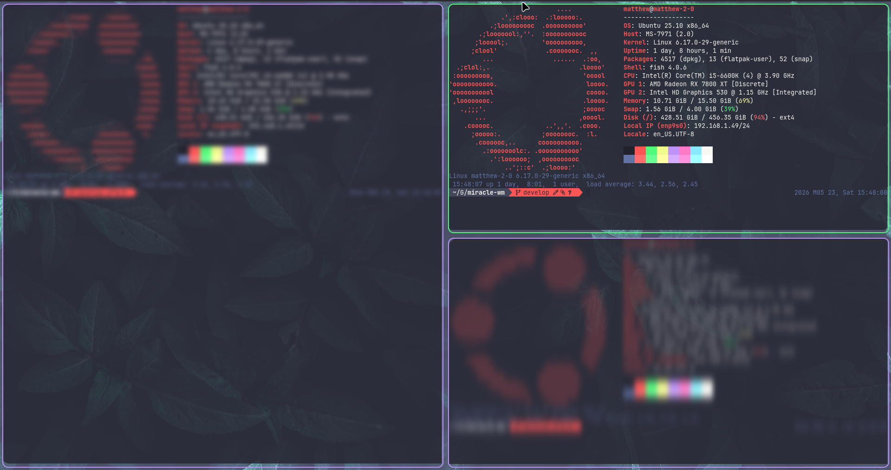

# focus-blur-plugin



A [miracle-wm](https://github.com/mattkae/miracle-wm) plugin that blurs unfocused windows using a two-pass separable Gaussian blur shader.

When a window loses focus it receives a horizontal-then-vertical Gaussian blur (radius 15px, sigma 5). When it regains focus the blur is removed. Attached (tiled) windows are unaffected.

## Installation

Download and install the latest nightly build:

```sh
curl -fsSL https://raw.githubusercontent.com/miracle-wm-org/focus-blur-plugin/main/install.sh | bash
```

Alternatively, manually add the plugin to your miracle-wm configuration file (`~/.config/miracle-wm/config.yaml`):

```yaml
plugins:
  - /path/to/focus-blur-plugin/target/wasm32-wasip1/release/focus_blur_plugin.wasm
```

## Building

### Prerequisites
```sh
sudo apt-get install -y libmircore-dev clang libclang-dev
rustup target add wasm32-wasip1
```

### Compilation
```sh
cargo build --target wasm32-wasip1 --release
```
The compiled WASM file can be found at `target/wasm32-wasip1/release/focus_blur_plugin.wasm`.
